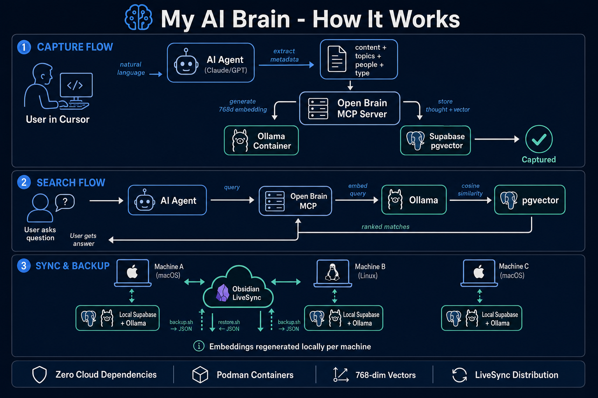

# My AI Brain — How It Works



---

## Overview

My AI Brain is a local-only personal knowledge system that gives AI agents (Cursor, Claude Code) persistent semantic memory. It combines two complementary layers:

- **Obsidian** — Structured long-form notes (documentation, guides, references)
- **Open Brain** — Semantic vector memory (quick thoughts, decisions, observations searchable by meaning)

Both are accessible to AI agents via the Model Context Protocol (MCP). All data stays local — no cloud services, no API keys to external providers, no recurring costs.

---

## Core Concepts

### Vector Embeddings

When you capture a thought, it gets converted into a 768-dimensional vector (an array of 768 numbers) that represents its semantic meaning. Two thoughts about similar topics will have similar vectors, even if they use completely different words.

This is what enables "search by meaning" — asking "what did I note about career changes" can find a thought that says "Sarah is thinking about leaving her job" because the vectors are close in semantic space.

### MCP (Model Context Protocol)

MCP is a standard protocol that lets AI agents call external tools. The Open Brain MCP server exposes 4 tools that any MCP-compatible client (Cursor, Claude Desktop, Claude Code) can use:

| Tool | What it does |
|------|-------------|
| `capture_thought` | Save content + metadata, generate embedding |
| `search_thoughts` | Find thoughts by semantic similarity |
| `list_thoughts` | Browse recent thoughts with filters |
| `thought_stats` | Get summary statistics |

### pgvector

PostgreSQL extension that adds vector data types and similarity search operators. Stored in the same database as the thought content and metadata, enabling combined vector + structured queries.

---

## Data Flows

### 1. Capture Flow

```
User: "Remember this: we decided to use Podman for all containers"
         │
         ▼
┌─────────────────────────────┐
│  AI Agent (Cursor/Claude)   │
│  Extracts metadata:         │
│  - type: decision           │
│  - topics: [podman]         │
│  - people: []               │
│  - action_items: []         │
└──────────────┬──────────────┘
               │ calls capture_thought(content, metadata)
               ▼
┌─────────────────────────────┐
│  Open Brain MCP Server      │
│  (Node.js stdio process)    │
└──────┬──────────────┬───────┘
       │              │
       ▼              ▼
┌──────────┐  ┌──────────────┐
│  Ollama  │  │   Supabase   │
│  embed() │  │   INSERT     │
│  → 768d  │  │   thought    │
└──────────┘  └──────────────┘
       │              │
       └──────┬───────┘
              ▼
    Row stored: content + [768 floats] + {metadata JSON}
```

**Timing:** ~300ms for embedding + ~50ms for DB insert = ~350ms total

### 2. Search Flow

```
User: "What did I decide about containers?"
         │
         ▼
┌─────────────────────────────┐
│  AI Agent calls             │
│  search_thoughts(query)     │
└──────────────┬──────────────┘
               │
               ▼
┌─────────────────────────────┐
│  Open Brain MCP Server      │
└──────────────┬──────────────┘
               │
               ▼
┌─────────────────────────────┐
│  Ollama: embed query → 768d │
└──────────────┬──────────────┘
               │
               ▼
┌─────────────────────────────┐
│  pgvector: cosine distance  │
│  against ALL thought vectors│
│  WHERE similarity > 0.5     │
│  ORDER BY similarity DESC   │
│  LIMIT 10                   │
└──────────────┬──────────────┘
               │
               ▼
  Results: [{content, metadata, 72.1% match}, ...]
```

**Timing:** ~300ms embedding + ~50ms vector search = ~350ms total

### 3. Backup & Sync Flow

```
Machine A                    Obsidian LiveSync              Machine B
─────────                    ────────────────              ─────────
backup.sh                                                  
    │                                                      
    ▼                                                      
open-brain-backup.json ────────────sync─────────────► open-brain-backup.json
(content + metadata only,                                      │
 no embeddings)                                                ▼
                                                          restore.sh
                                                              │
                                                    ┌─────────┼──────────┐
                                                    ▼         ▼          ▼
                                              Local Ollama  Supabase   Done
                                              re-embed      INSERT
                                              each thought  with new
                                              (768d)        vectors
```

Embeddings are NOT transferred — they're regenerated on each machine. Same model + same content = identical vectors.

---

## Infrastructure Stack

### Containers (all Podman, rootless)

| Container | Image | Port | Persistent Volume |
|-----------|-------|------|-------------------|
| ollama | `ollama/ollama:latest` | 11434 | `ollama_data` (models) |
| supabase_db_* | `supabase/postgres:17` | 54322 | `supabase_db_*` (all data) |
| supabase_kong_* | `supabase/kong:2.8` | 54321 | — |
| supabase_studio_* | `supabase/studio` | 54323 | — |
| + 8 more supabase containers | various | internal | — |

### Database Schema

```sql
thoughts (
  id          uuid PRIMARY KEY
  content     text NOT NULL          -- the raw thought
  embedding   vector(768)            -- nomic-embed-text output
  metadata    jsonb                  -- {type, topics, people, action_items, source}
  created_at  timestamptz
  updated_at  timestamptz
)

-- Indexes:
-- GIN on metadata (for filtering by type/topic/person)
-- B-tree on created_at DESC (for recent browsing)
-- (IVFFlat on embedding deferred until >1000 rows)

-- Function:
-- match_thoughts(query_embedding, threshold, count, filter)
-- Returns rows ranked by cosine similarity
```

### Embedding Model

| Property | Value |
|----------|-------|
| Model | nomic-embed-text |
| Dimensions | 768 |
| Size on disk | 274MB |
| Inference speed | ~300ms per text |
| Max input | ~8192 tokens |
| Quality | Strong for general English text |

---

## Security Model

- **No external network calls** — all inference and storage is local
- **No API keys to external services** — Ollama and Supabase are self-hosted
- **Supabase RLS** — Row Level Security restricts access to service role only
- **Service role key** — generated per-instance, stored in Cursor env config (not committed to git)
- **Obsidian HTTPS** — self-signed cert on port 27124, API key required

---

## File Layout

```
~/Github/my_ai_brain/              ← Setup project (git repo)
├── mcp-server/src/index.ts        ← MCP server implementation
├── scripts/backup.sh              ← Export to vault JSON
├── scripts/restore.sh             ← Import + re-embed
├── scripts/verify.sh              ← 10-point health check
├── sql/001-setup.sql              ← Database schema
└── docs/                          ← Documentation + infographic

~/supabase/                        ← Supabase CLI project
├── config.toml                    ← Local instance config

~/.cursor/
├── mcp.json                       ← MCP server registrations
├── rules/open-brain-preflight.mdc ← Auto-check services
├── skills/open-brain/SKILL.md     ← Infrastructure management
├── hooks.json                     ← Session-end backup hook
└── hooks/open-brain-backup.sh     ← Backup script

~/Documents/.../Obsidian-Work/     ← Obsidian vault (synced via LiveSync)
├── open-brain-backup.json         ← Thought export (syncs to all machines)
├── Learnings/open-brain-local-setup.md
├── Tools/open-brain-usage.md
└── Tools/open-brain-how-it-works.md
```

---

## Cursor Integration Points

| Component | Purpose | Location |
|-----------|---------|----------|
| MCP Server | Exposes brain tools to AI agents | `~/.cursor/mcp.json` → `open-brain` |
| Preflight Rule | Checks Ollama + Supabase before tool use | `~/.cursor/rules/open-brain-preflight.mdc` |
| Infrastructure Skill | Detailed troubleshooting for agents | `~/.cursor/skills/open-brain/SKILL.md` |
| Session Hook | Auto-backup on session end | `~/.cursor/hooks.json` → `sessionEnd` |

---

## Limitations & Trade-offs

| Limitation | Reason | Mitigation |
|-----------|--------|------------|
| No real-time sync between machines | Each machine has independent Supabase | backup.sh + LiveSync + restore.sh |
| Requires Obsidian open for vault MCP | Local REST API only runs when app is active | Rule reminds agent; non-blocking |
| 768d vectors vs 1536d (OpenAI) | nomic-embed-text trade-off for local speed | Adequate for personal knowledge base scale |
| No full-text fallback | Relies on embeddings for search | `list_thoughts` with filters as alternative |
| Container startup time | ~5s for Supabase after reboot | Preflight rule handles wait |
